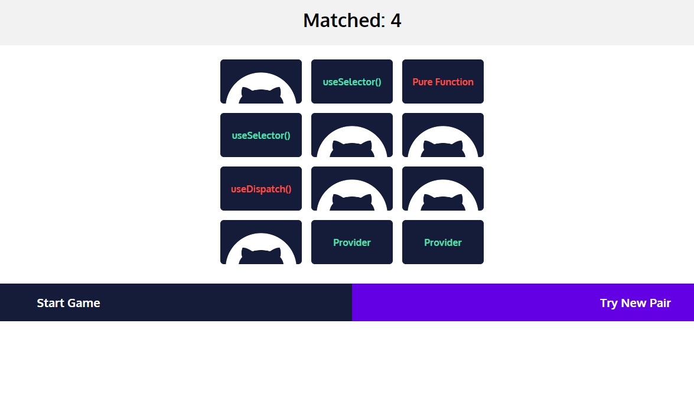

# Matching Cards - Memory Game

I made this project as training and to learn to use the React Hooks and Redux, in distributing the data from a container to a very deepen children.

The application supports the next features:
+ Click on "**Start Game**" button to start the game.
+ You can click on every card, until you find the pair.

